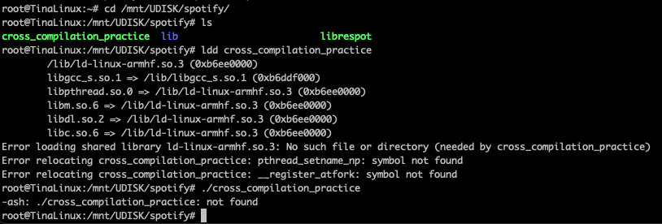

# cross_compilation_practice

### 4 Cross build through Docker but for gnueabihf instead of musleabihf
Changed target on Dockerfile, Cross.toml and commanf to run from 'musl' to 'gnu'. Compilation went proper but attempt to run application results in missing dependencies.

### 3 Cross build through Docker
Prepared container was build with `docker build -t crossbuild_test .` and then run with `cross build --target=armv7-unknown-linux-musleabihf --release`. Works on vacuum. 

### 2 UUID and SysInfo
Build with same command. Does not produce any errors but temperature info is missing on vacuum.

### 1 Hello Tokio
Build wih `CARGO_TARGET_ARMV7_UNKNOWN_LINUX_MUSLEABIHF_LINKER=rust-lld cargo build --release --target armv7-unknown-linux-musleabihf`

Works on Vacuum flawlessly.

